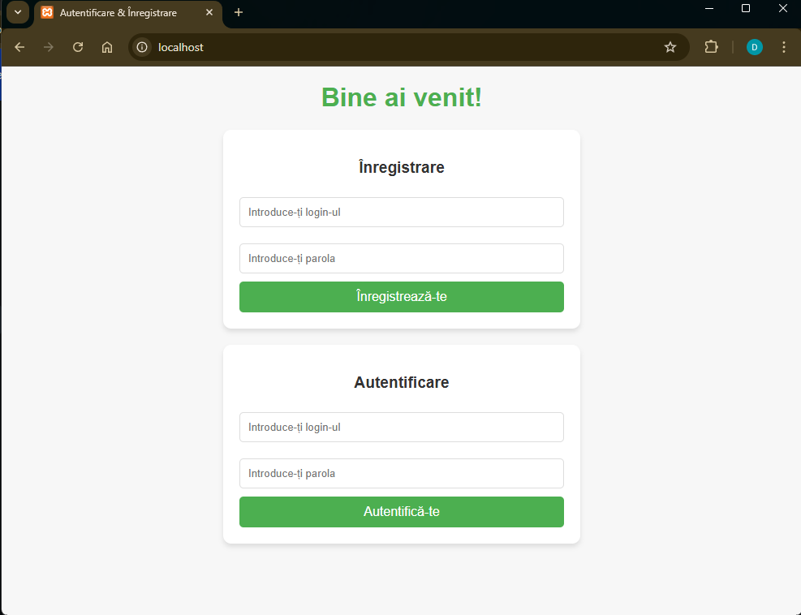

# Darea de Seamă
**Lucrarea de Laborator nr. 7: Crearea unei aplicații multi-container**

---

## Scopul lucrării
Familiarizarea cu gestiunea aplicației multi-container creat cu docker-compose.

## Sarcina
Crearea unei aplicații PHP pe baza a trei containere: nginx, php-fpm, mariadb, folosind docker-compose.

---

## Descrierea executării lucrării

### Pasul 1: Crearea structurii proiectului
Am creat directorul principal `containers07` și am organizat structura proiectului:

```bash
mkdir -p containers07/mounts/site
mkdir -p containers07/nginx
```

### Pasul 2: Configurarea fișierului .gitignore
Am creat fișierul `.gitignore` în rădăcina proiectului pentru a exclude site-ul PHP din urmărirea git:

```gitignore
mounts/site/*
```

### Pasul 3: Configurarea Nginx
Am creat fișierul de configurare pentru server-ul Nginx:

```nginx
server {
    listen 80;
    server_name _;
    root /var/www/html;
    index index.php;
    location / {
        try_files \$uri \$uri/ /index.php?\$args;
    }
    location ~ \.php$ {
        fastcgi_pass backend:9000;
        fastcgi_index index.php;
        fastcgi_param SCRIPT_FILENAME \$document_root\$fastcgi_script_name;
        include fastcgi_params;
    }
}
```

### Pasul 4: Configurarea Docker Compose
Am creat fișierul `docker-compose.yml` în directorul containers06:

```yml
version: '3.9'

services:
  frontend:
    image: nginx:1.19
    volumes:
      - ./mounts/site:/var/www/html
      - ./nginx/default.conf:/etc/nginx/conf.d/default.conf
    ports:
      - "80:80"
    networks:
      - internal
  backend:
    image: php:7.4-fpm
    volumes:
      - ./mounts/site:/var/www/html
    networks:
      - internal
    env_file:
      - mysql.env
  database:
    image: mysql:8.0
    env_file:
      - mysql.env
    networks:
      - internal
    volumes:
      - db_data:/var/lib/mysql

networks:
  internal: {}

volumes:
  db_data: {}
```

### Pasul 5: Configurarea variabilelor de mediu pentru MySQL
Am creat fișierul `mysql.env` cu credențiale pentru MySQL:

```conf
MYSQL_ROOT_PASSWORD=secret
MYSQL_DATABASE=app
MYSQL_USER=user
MYSQL_PASSWORD=secret
```

### Pasul 6: Adăugarea site-ului PHP
Am adăugat un site PHP creat în cardul disciplinei în `mounts/site`.

### Pasul 7: Pornirea containerelor
Am pornit containerele cu comanda:

```bash
docker-compose up -d
```

### Pasul 8: Verificarea funcționării
Am accesat aplicația în browser la adresa http://localhost și am confirmat că aceasta funcționează corect, afișând pagina PHP.


## Răspunsuri la întrebări

### 1. În ce ordine sunt pornite containerele?
Containerele sunt pornite în ordinea dependențelor definite în fișierul docker-compose.yml. În acest caz, ordinea este:
1. `database` (MySQL) - nu are dependențe
2. `backend` (PHP-FPM) - depinde de baza de date
3. `frontend` (Nginx) - depinde de backend

Docker-compose asigură această ordine în mod automat în baza dependențelor dintre servicii.

### 2. Unde sunt stocate datele bazei de date?
Datele bazei de date sunt stocate într-un volum Docker named `db_data`. Acest volum este definit în secțiunea `volumes` din fișierul docker-compose.yml și este atașat la containerul `database`.

Volumul persistent asigură că datele din baza de date rămân intacte chiar și atunci când containerul este oprit sau eliminat.

### 3. Cum se numesc containerele proiectului?
Conform configurării din docker-compose, numele containerelor vor fi:
- `containers07_frontend_1`
- `containers07_backend_1`
- `containers07_database_1`

Numele se formează după regula: `[nume_director]_[nume_serviciu]_[număr_replică]`. În cazul meu, `containers07` este numele directorului care conține fișierul docker-compose.yml.

### 4. Trebuie să adăugați încă un fișier `app.env` cu variabila de mediu `APP_VERSION` pentru serviciile `backend` și `frontend`. Cum se face acest lucru?

Este necesar să adăugăm fișierul app.env și să-l includem în secțiunea env_file a serviciilor interesate (frontend și backend). Configurarea a fost făcută astfel:

```yml
env_file:
  - app.env
```

Conținutul fișierului app.env este următorul:

```env
APP_VERSION=1.0
```

După această modificare, variabila de mediu `APP_VERSION` va fi disponibilă în containerele frontend și backend.

## Concluzii
În cadrul acestei lucrări de laborator, am creat cu succes o aplicație multi-container folosind Docker Compose, care integrează trei servicii esențiale pentru o aplicație web: Nginx ca server web, PHP-FPM pentru procesarea codului PHP și MySQL ca bază de date.

Am învățat cum să:
1. Configurez fișierul docker-compose.yml pentru a defini mai multe servicii care lucrează împreună
2. Configurez serverul Nginx pentru a redirecționa solicitările PHP către containerul PHP-FPM
3. Partajez volume între containere pentru a asigura accesul la codul sursă al aplicației
4. Utilizez variabile de mediu pentru configurarea serviciilor
5. Gestionez persistența datelor prin utilizarea volumelor Docker

Această abordare demonstrează avantajele containerizării și cum Docker Compose simplifică gestionarea aplicațiilor complexe cu mai multe componente care trebuie să comunice între ele. În loc să configurăm manual fiecare container și să stabilim conexiunile între ele, Docker Compose ne permite să definim toată infrastructura într-un singur fișier, simplificând semnificativ procesul de dezvoltare și implementare.